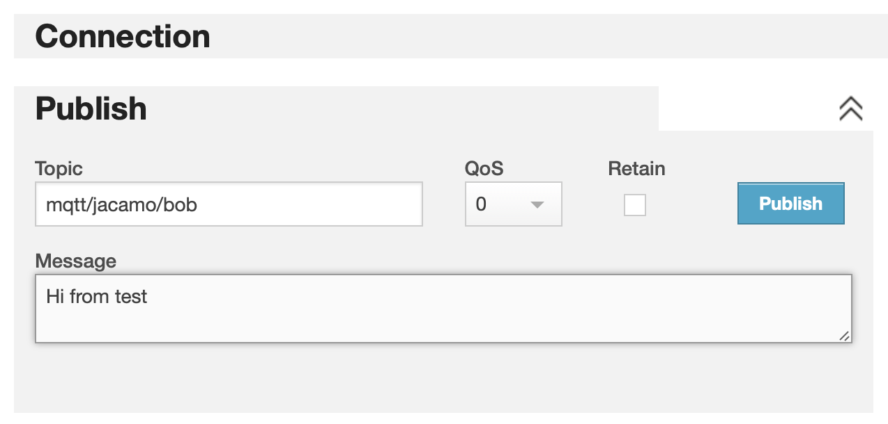
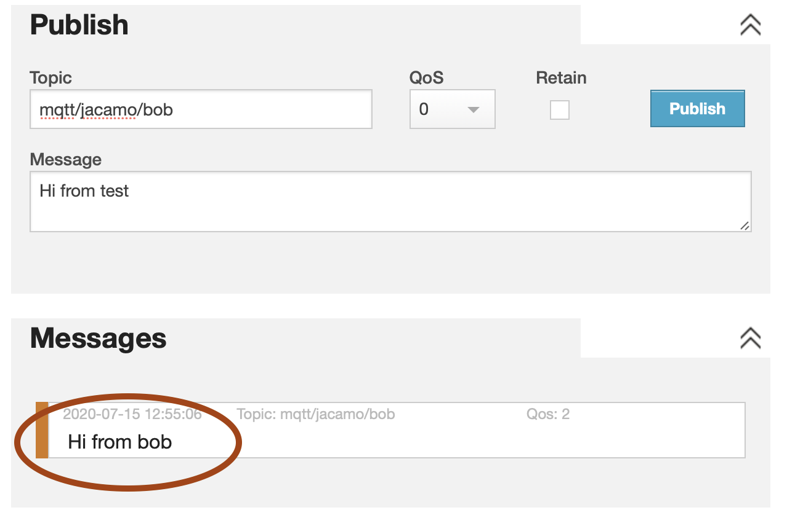

# Demo JaCaMo + NodeRed + MQTT

This demo presents an integration scenario where one agent leverage the MQTT protocol using ACL messages.


## Understanding the demo

The scenario consists of four entities:

* A JaCaMo application where agent Bob runs
* Node-RED
* MQTT Broker
* You

In this scenario, the agents interact with an _MQTT broker_. [MQTT](http://mqtt.org/) is a lightweight protocol for messaging transport in a publish/subscribe pattern, and an MQTT broker is a server that receives messages from _publishers_ and routes them to the appropriate _subscribers_. MQTT clients publish and subscribe to so-called _topics_. In this demo we use the topic __mqtt/jacamo/bob__.

A central entity to this scenario is the [Node-RED](https://nodered.org/), an integration tool that provides a browser-based editor to wire together hardware devices, APIs, and online services using a wide range of _nodes_. Here, it is responsible for integrating the JaCaMo apps and the MQTT broker. Its job is in this demo is:

- send an ACL message to Bob whenever something is published at _mqtt/jacamo/bob_.

- when bob send a message to NodeRed, it publish the message's content at _mqtt/jacamo/bob_.

## Steps to execute

Create a docker image for the JaCaMo application:

```
cd demos/demo-nodered-mqtt/jacamo
gradle clean copyToLib
docker build -t jacamo-rest/demo/nodered1:0.1 .
```
Run the JaCaMo application and NodeRed usuing docker compose:

```
cd ..
docker-compose up
```

The output is something like
```
nodered_1  | 15 Jul 12:29:10 - [info] Starting flows
nodered_1  | 15 Jul 12:29:10 - [info] Started flows
nodered_1  | 15 Jul 12:29:10 - [info] Server now running at http://127.0.0.1:1880/
nodered_1  | 15 Jul 12:29:10 - [info] [mqtt-broker:7d5786c9.7bf498] Connected to broker: mqtt://broker.hivemq.com:1883
bob_1      | [NetworkListener] Started listener bound to [{0}]
bob_1      | [HttpServer] [{0}] Started.
bob_1      | [JCMRest] JaCaMo Rest API is running on http://172.24.0.3:8080/.
bob_1      | CArtAgO Http Server running on http://172.24.0.3:3273
bob_1      | Jason Http Server running on http://172.24.0.3:3272
bob_1      | [bob] Bob is running
```

## Send a message to Bob

Open the [HiveMQ client web page](http://www.hivemq.com/demos/websocket-client) and click on *connect*. To send a message to Bob, fill the form as follows (note the topic `mqtt/jacamo/bob` that Bob is listening to):



When you click on *Publish*, a message is shown in bob console::
```
bob_1      | [bob] New message: Hi from test
bob_1      | [bob] Source: mqtt
```

## Bob sending a message to MQTT

Open the NodeRed server [web page](http://127.0.0.1:1880) and click on the icon indicated bellow:


In the MQTT web page you will notice:



## Implementation

__under construction__

For now, see the source code.
