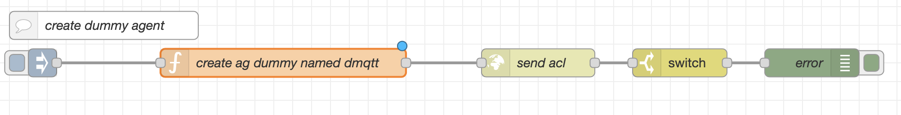
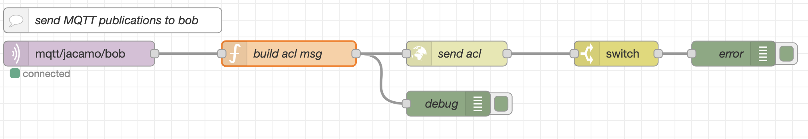
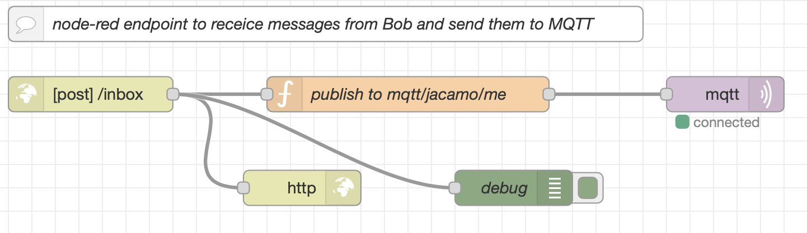

# Demo JaCaMo + Node-RED + MQTT

This demo presents an integration scenario where one agent leverages the MQTT protocol using ACL messages.


## Understanding the demo

The scenario consists of four entities:

* A JaCaMo application where agent Bob runs
* Node-RED
* MQTT Broker
* You

In this scenario, the agent interacts with an _MQTT broker_. [MQTT](http://mqtt.org/) is a lightweight protocol for messaging transport in a publish/subscribe pattern, and an MQTT broker is a server that receives messages from _publishers_ and routes them to the appropriate _subscribers_. MQTT clients publish and subscribe to so-called _topics_. In this demo we use the topic __mqtt/jacamo/bob__.

A central entity to this scenario is the [Node-RED](https://nodered.org/), an integration tool that provides a browser-based editor to wire together hardware devices, APIs, and online services using a wide range of _nodes_. Here, it is responsible for integrating the JaCaMo app and the MQTT broker. Its job in this demo is:

1. create a dummy agent representing the MQTT in the MAS, so that agent Bob sees MQTT as an agent (named `dmqtt` in this demo)

2. send an ACL (Agent Communication Language) message to Bob whenever something is published at _mqtt/jacamo/bob_.

3. when bob sends a message to `dmqtt`, NodeRed receives the message and publishes the message's content at _mqtt/jacamo/me_.

## Steps to execute

```
docker-compose up
```

It starts the NodeRed and the JaCaMo application, both based on available Docker images. The sources of the JaCaMo application are placed in the folder `jacamo`.

The output is something like

```
nodered_1  | 15 Jul 12:29:10 - [info] Starting flows
nodered_1  | 15 Jul 12:29:10 - [info] Started flows
nodered_1  | 15 Jul 12:29:10 - [info] Server now running at http://127.0.0.1:1880/
nodered_1  | 15 Jul 12:29:10 - [info] [mqtt-broker:7d5786c9.7bf498] Connected to broker: mqtt://broker.hivemq.com:1883
bob_1      | [NetworkListener] Started listener bound to [{0}]
bob_1      | [HttpServer] [{0}] Started.
bob_1      | [JCMRest] JaCaMo Rest API is running on http://172.24.0.3:8080/.
bob_1      | CArtAgO Http Server running on http://172.24.0.3:3273
bob_1      | Jason Http Server running on http://172.24.0.3:3272
bob_1      | [bob] Bob is running
```

## Interacting with agent Bob

- Open the [HiveMQ client web page](http://www.hivemq.com/demos/websocket-client) and click on *connect*.

- In the HiveMQ client web page, subscribe to notification on the topic _mqtt/jacamo/me_:


- To send a message to Bob, fill the form as follows (note the topic `mqtt/jacamo/bob` that Bob is listening to):


When you click on *Publish*, Bob prints out a message:

```
mas_1      | [bob] New message: test_msg_1
mas_1      | [bob] Source: dmqtt
```

and sends back a message to `dmqtt` that can be noticed in the topic _mqtt/jacamo/me_:


Note: You can inspect Bob's mind at [http://localhost:3272](http://localhost:3272).

Stop the application:

```
docker-compose down
```

## Implementation

The implementation is essentially based on NodeRed. It is responsible for:

1. creating a dummy agent (named `dmqtt` in the MAS),

2. notifying Bob about new publications at _mqtt/jacamo/bob_,

3. publishing at _mqtt/jacamo/me_ all messages received by the dummy agent.

The integration code (i.e., the flows in NodeRed) can be seen in the [NodeRed web interface](http://127.0.0.1:1880) and are commented below.

#### Dummy Agent

To make the integration transparent for Bob, the MQTT is _represented_ by an agent in the MAS. Bob interacts with this agent by ACL as it is used to. The MQTT agent counterpart is not a running agent, it is simply an entry in the MAS White Pages services. This entry has the following main attributes:

- agent name: `dmqtt`
- the URL of the mailbox of `dmqtt`: `http://nodered:1880/inbox`

When Bob sends a message to `dmqtt`, JaCaMo delivers the message to `http://nodered:1880/inbox`. The host `nodered` is where NodeRed is running. The end point `inbox` is explained later.

The dummy agent is created using the JaCaMo REST API: a `POST` to `http://mas:8080/agents`. The host `mas` is where the JaCaMo application and its REST API are running.



#### MQTT to Bob

NodeRed listens to the MQTT topic _mqtt/jacamo/bob_ and, for each new publication, sends a message to Bob using ACL. For instance, if `hello` is published, the ACL message below is sent.

```
{
      sender: dmqtt,
      receiver: bob,
      performative: tell,
      content: \"hello\",
}
```
Again, to deliver the message to Bob, JaCaMo REST is used: a `POST` to `http://mas:8080/agents/bob/inbox`.



#### Bob to MQTT

When Bob sends a message to `dmqtt`, JaCaMo consults the White Pages, discovers its URL ( `http://nodered:1880/inbox`), and dispatches the message there. NodeRed listens to the `inbox` end-point and publishes at _mqtt/jacamo/me_ the content of the message.


