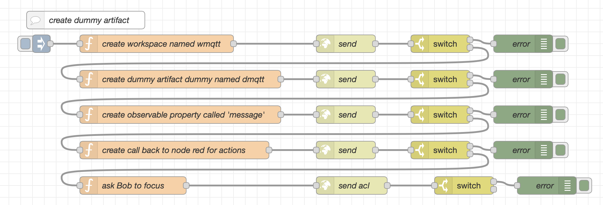
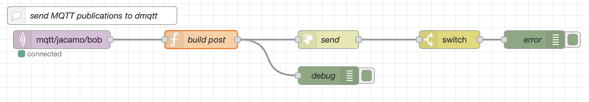
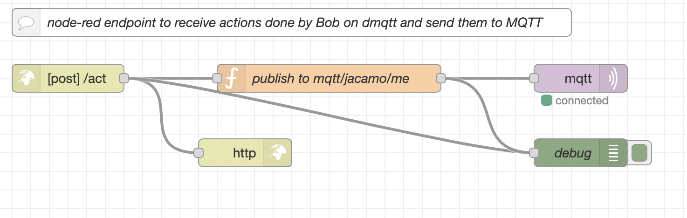

# Demo JaCaMo + Node-RED + MQTT (by dummy artifacts)

This demo presents an integration scenario where one agent leverages the MQTT protocol using perception and action. It looks for an MAS code that has no reference to outside elements (MQTT, in the case).


## Understanding the demo

The scenario consists of four entities:

* A JaCaMo application where agent Bob runs
* Node-RED
* MQTT Broker
* You

In this scenario, the agent interacts with an _MQTT broker_. [MQTT](http://mqtt.org/) is a lightweight protocol for messaging transport in a publish/subscribe pattern, and an MQTT broker is a server that receives messages from _publishers_ and routes them to the appropriate _subscribers_. MQTT clients publish and subscribe to so-called _topics_. In this demo we use the topic __mqtt/jacamo/bob__.

A central entity to this scenario is the [Node-RED](https://nodered.org/), an integration tool that provides a browser-based editor to wire together hardware devices, APIs, and online services using a wide range of _nodes_. Here, it is responsible for integrating the JaCaMo app and the MQTT broker. Its job in this demo is:

1. create and configure a dummy *artifact* representing the MQTT in the MAS, so that agent Bob sees MQTT as an artifact (named `dmqtt` in this demo)

2. when something is published at _mqtt/jacamo/bob_, NodeRed updates the observable properties of the artifact so that Bob perceives the publication.

3. when Bob acts on `dmqtt` publishing something, NodeRed notices the action forwards the publication to _mqtt/jacamo/me_.

## Steps to execute

```
docker-compose up
```

It starts the NodeRed and the JaCaMo application, both based on available Docker images. The sources of the JaCaMo application are placed in the folder `app_jacamo`.

The output is something like

```
mas_1      | [JCMRest] JaCaMo Rest API is running on http://172.18.0.2:8080/.
mas_1      | Jason Http Server running on http://172.18.0.2:3272
mas_1      | [bob] Bob is running
mas_1      | Workspace wmqtt created!
mas_1      | [bob] focusing on artifact dmqtt (at workspace /main/wmqtt) using namespace ns1
mas_1      | [bob] New message: start
mas_1      | [bob] Source: dmqtt
```

## Interacting with agent Bob

- Open the [HiveMQ client web page](http://www.hivemq.com/demos/websocket-client) and click on *connect*.

- In the HiveMQ client web page, subscribe to notification on the topic _mqtt/jacamo/me_:


- To send a message to Bob, fill the form as follows (note the topic `mqtt/jacamo/bob` that Bob is listening to):


When you click on *Publish*, Bob prints out a message:

```
mas_1      | [bob] New message: test_msg_1
mas_1      | [bob] Source: dmqtt
```

and sends back a message to `dmqtt` that can be noticed in the topic _mqtt/jacamo/me_:


Note: You can inspect Bob's mind at [http://localhost:3272](http://localhost:3272).

Stop the application:

```
docker-compose down
```

## Implementation

The integration is essentially based on NodeRed. It is responsible for:

1. creating a dummy artifact (named `dmqtt` in the MAS),

2. notifying Bob about new publications at _mqtt/jacamo/bob_,

3. publishing at _mqtt/jacamo/me_ all actions performed on the dummy artifact.

The integration code (i.e., the flows in NodeRed) can be seen in the [NodeRed web interface](http://127.0.0.1:1880) and are commented below.

#### Dummy Artifact

To make the integration transparent for Bob, the MQTT is _represented_ by an *artifact* in the MAS. Bob interacts with this artifact by perception/action as it is used to. This artifact is created from a _template_ available in JaCaMo-REST called _DummyArt_.

When Bob acts on the artifact `dmqtt`, the artifact delivers the message to `http://nodered:1880/act`. The host `nodered` is where NodeRed is running. The end point `act` is explained later.

The dummy artifact is created using the JaCaMo REST API:

1. a workspace called `wmqtt` is create by a `POST` to `http://mas:8080/workspaces/wmqtt`. The host `mas` is where the JaCaMo application and its REST API are running.

2. a DummyArt called `dmqtt` is created on that workspace by a `POST` to `http://mas:8080/workspaces/wmqtt/artifacts/dmqtt`.

3. an observable property called `message` is created on that artifgact by a `POST` to `http://mas:8080/workspaces/wmqtt/artifacts/dmqtt/operations/doDefineObsProperty/execute`.

4. a call back is registered on the artifgact by a `POST` to `http://mas:8080/workspaces/wmqtt/artifacts/dmqtt/operations/register/execute`. The call back end point is `http://nodered:1880/act` so that when an agent performs `act` on DummyArt, this end point is informed.

5. Bob is asked to focus on the dummy artifact.



#### MQTT to artifact (and thus to Bob)

NodeRed listens to the MQTT topic _mqtt/jacamo/bob_ and, for each new publication, it updates the observable property `message`. It is performed by a `POST` to `http://mas:8080/workspaces/wmqtt/artifacts/dmqtt/operations/doUpdateObsProperty/execute`.



#### Bob to MQTT

When Bob performs `act` on the artifact, the DummyArt dispatches the arguments to (`http://nodered:1880/act`). NodeRed listens the `act` end-point and publishes at _mqtt/jacamo/me_ the content of the message.


