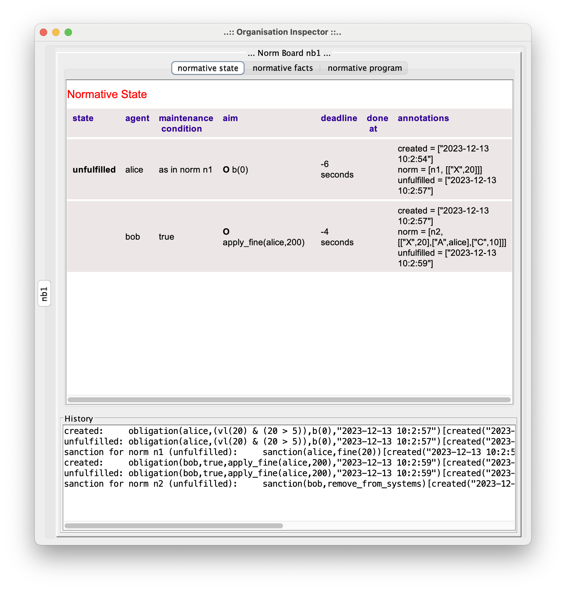
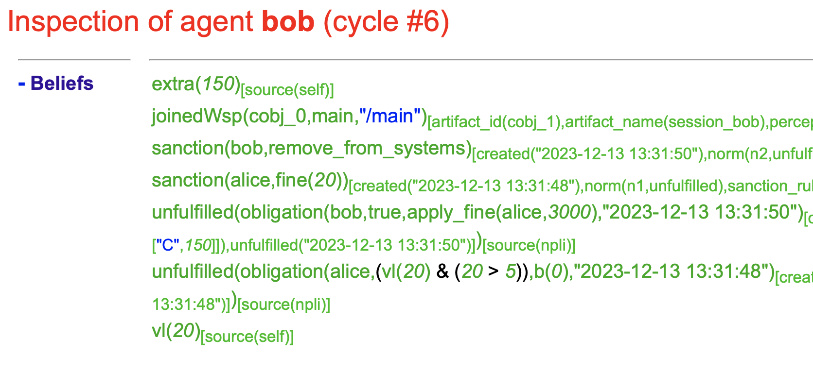

This JaCaMo demo application illustrates the use of _sanctions_. It implements the following "history":

- A norm is activated and obliges Alice to do something in 3 seconds. The fact that triggered the norms is `vl(20)` and the norm in https://github.com/moise-lang/npl[NPL] is:
```
norm n1: vl(X) & X > 5
   -> obligation(alice,n1, b(0), `3 seconds`)
      if unfulfilled: sr1(alice,X).

sanction-rule sr1(Ag,Value) -> sanction(Ag,fine(Value)).
```

- Alice does not fulfill the obligation on time!

- The sanction rule `sr1` is thus considered and its consequence is `sanction(alice,fine(20))`.

- That sanction triggers the following norm:

```
// bob is obliged to apply fines in two seconds
norm n2: sanction(A,fine(X)) & extra(C)
   -> obligation(bob,true,apply_fine(A,X*C),`2 seconds`)
      if unfulfilled: sr2.

sanction-rule sr2 -> sanction(bob,remove_from_systems).
```

- Bob also decides to not fulfill its obligation!

- So, sanction rule `sr2` is considered and its consequence is `sanction(bob,remove_from_systems)`.

- In this example, the sanction is implemented (instrumented) in the environment. An artifact executes an operation `remove_from_systems`. However, for other application, it could be an agent that is responsible to handle the fact `sanction(bob,remove_from_systems)`.

## Notes

* The specification of the norms and sanctions are in file link:./src/org/demo.npl[demo.npl]

* The application is executed by agent Karlos that:

  -  Creates the artifact `NormativeBoard` that is responsible to compute obligations and sanctions based on the normative specification of `demo.npl`.
  - Creates the artifact link:./src/env/police/Sanctioner.java[`Sanctioner`] that is responsible to implement in the environment the (brute) consequences of sanctions.
  - Adds some facts that trigger norms.
  - Monitors the normative events and prints some of them.

* Since we are focused on the normative events, agents Alice and Bob do not exist in the application.

* Two implementations of sanctions are illustrated in this example:

   - sanctions that produce obligations for  agents (`sanction(A,fine(X))`).
   - sanctions that are handled by the environment (`sanction(bob,remove_from_systems)`). As illustrated in this demo, this implementation of sanctions lead to _regimented_ sanctions. Sanctions are instrumented in the environment and there is no way to "scape" from its consequences. It mimics human sanctions like automatic fines produced by traffic light controllers. However, sanctions may be also read by agents that decide how to proceed with the sanction. See the source code of agent Karlos to see how sanction can be perceived.


## Result of the execution

To run the demo, execute `./gradlew` in the demo folder:

```
[karlos] Unfulfilled obligation(alice,(vl(20) & (20 > 5)),b(0),"2023-12-13 10:2:57")[created("2023-12-13 10:2:54"),norm(n1,[["X",20]]),unfulfilled("2023-12-13 10:2:57")]

[karlos] Sanction fine(20) for alice created from norm n1 that is unfulfilled

[karlos] Unfulfilled obligation(bob,true,apply_fine(alice,200),"2023-12-13 10:2:59")[created("2023-12-13 10:2:57"),norm(n2,[["X",20],["A",alice],["C",10]]),unfulfilled("2023-12-13 10:2:59")]

[karlos] Sanction remove_from_systems for bob created from norm n2 that is unfulfilled

[Sanctioner] **** I am implementing the sanction for bob ****
```



## Agent with a Normative Engine

By running `./gradlew runNAg`, agent link:./src/agt/bob.asl[Bob] is created. This agent runs the NPL engine internally. The facts are his beliefs. (no artifact is used.)

Result of the execution:

```
[bob] *** loading norms from src/org/demo.npl

[bob] Unfulfilled obligation(alice,(vl(20) & (20 > 5)),b(0),"2023-12-13 13:58:51")[created("2023-12-13 13:58:48"),norm(n1,[["X",20]]),unfulfilled("2023-12-13 13:58:51")]

[bob] Sanction fine(20) for alice created from norm n1 that is unfulfilled

[bob] Unfulfilled obligation(bob,true,apply_fine(alice,3000),"2023-12-13 13:58:53")[created("2023-12-13 13:58:51"),norm(n2,[["X",20],["A",alice],["C",150]]),unfulfilled("2023-12-13 13:58:53")]

[bob] **** I am implementing the sanction for bob ****
```




