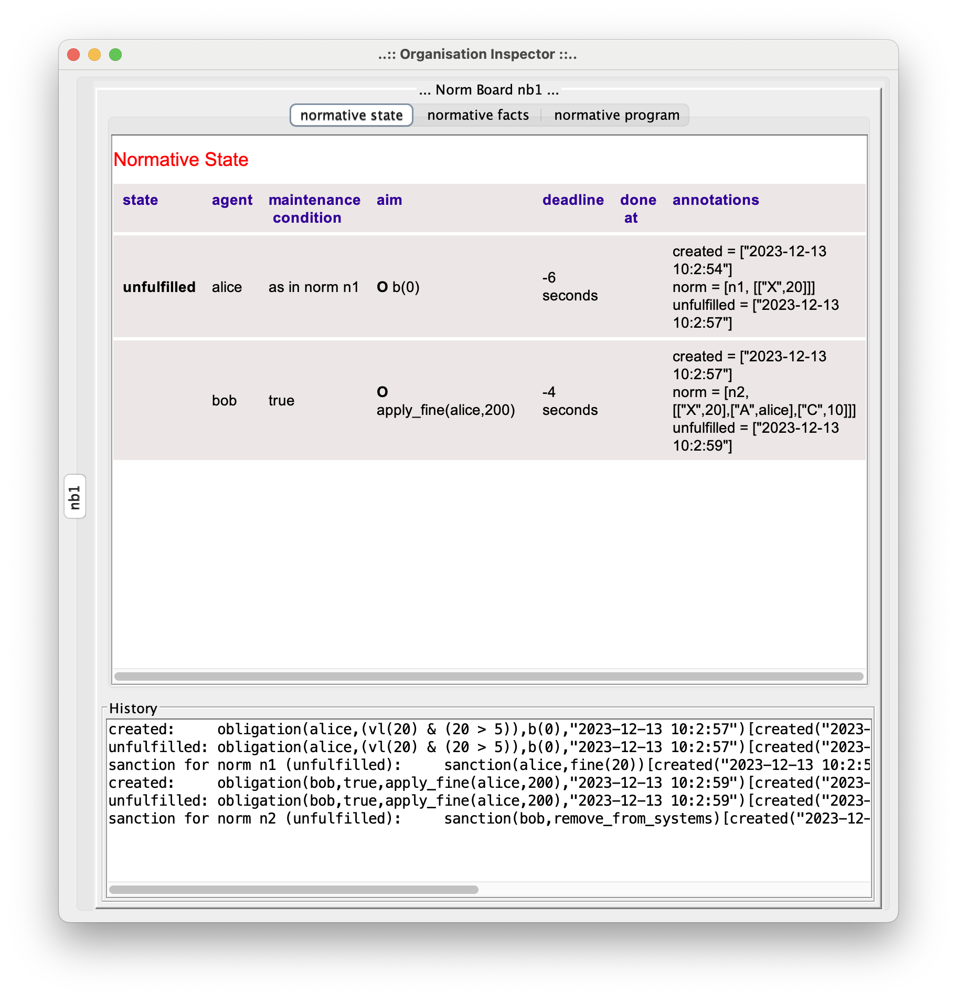

This JaCaMo demo application illustrates the use of _sanctions_. It implements the following "history":

1. A norm is activated and obliges Alice to do something in 3 seconds. The norm is:
```
    norm n1: vl(X) & X > 5
       -> obligation(alice,n1, b(0), `now`+`3 seconds`)
       if unfulfilled: s1(alice,X).
```

2. Alice does not fulfill the obligation on time!

3. The sanction `s1` is thus triggered and obliges Bob to decide whether to fine Alice or not. The sanction specification is:
```
    sanction s1(A,X): c(Y) -> obligation(bob,true,fine(A,X*Y),`now`+`2 seconds`)
       if unfulfilled: s2.
```

4. Bob also decides to not fulfill its obligation!

5. So, sanction `s2` is triggered. Its specification is:
```
    sanction s2 -> remove_from_systems(bob).
```

6. In this case, the sanction is implemented (instrumented) in the environment. An artifact executes operation to realize  `remove_from_systems(bob)`.

## Notes

* The specification of the norms and sanctions are in file link:./src/org/demo.npl[demo.npl]

* The application is executed by agent Karlos that:

  -  Creates the artifact `NormativeBoard` that is responsible to compute obligations and sanctions based on the normative specification of `demo.npl`.
  - Creates the artifact link:./src/env/police/Sanctioner.java[`Sanctioner`] that is responsible to implement in the environment to brute consequences of sanctions.
  - Adds some facts that trigger norms.
  - Monitors the normative events and prints some of them.

* Since we are focused on the normative events, agents Alice and Bob do not exist in the application.

* Two kinds of sanctions are conceived in the language:

   - sanctions that produce obligations for an agent to decide how to proceed (sanction `s1` in this demo).
   - sanctions that are _regimented_, they are implemented in the environment and there is no way to "scape" from its consequences (sanction `s2` in this demo). It mimics human sanctions like automatic fines produced by traffic light controllers.

## Result of the execution

To run the demo, execute `./gradlew` in the demo folder:

```
[karlos] Unfulfilled obligation(alice,(vl(20) & (20 > 5)),b(0),"2023-10-5 18:49:18")[created("2023-10-5 18:49:15"),norm(n1,[["X",20]]),unfulfilled("2023-10-5 18:49:18")]
[karlos] Sanction obligation(bob,true,fine(alice,200),"now + 1 seconds"),sanction(s1,[...])] created for norm n1 that is unfulfilled
[karlos] Unfulfilled obligation(bob,true,fine(alice,200),"2023-10-5 18:49:20")[created("2023-10-5 18:49:18"),norm(s1,[...]),sanction(s1,[...]),unfulfilled("2023-10-5 18:49:20")]
[karlos] Sanction remove_from_systems(bob)[created("2023-10-5 18:49:20"),norm(s1,unfulfilled,s2),sanction(s2,[])] created for norm s1 that is unfulfilled

[Sanctioner] **** I am implementing the sanction for bob ****
```





