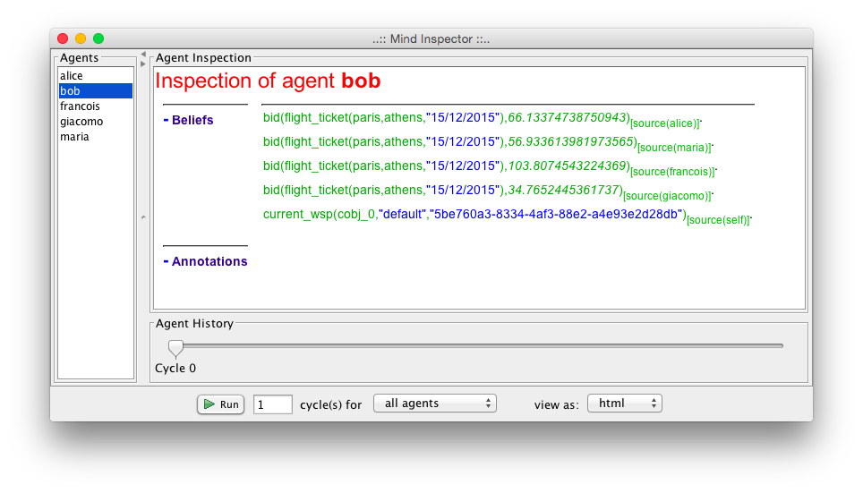
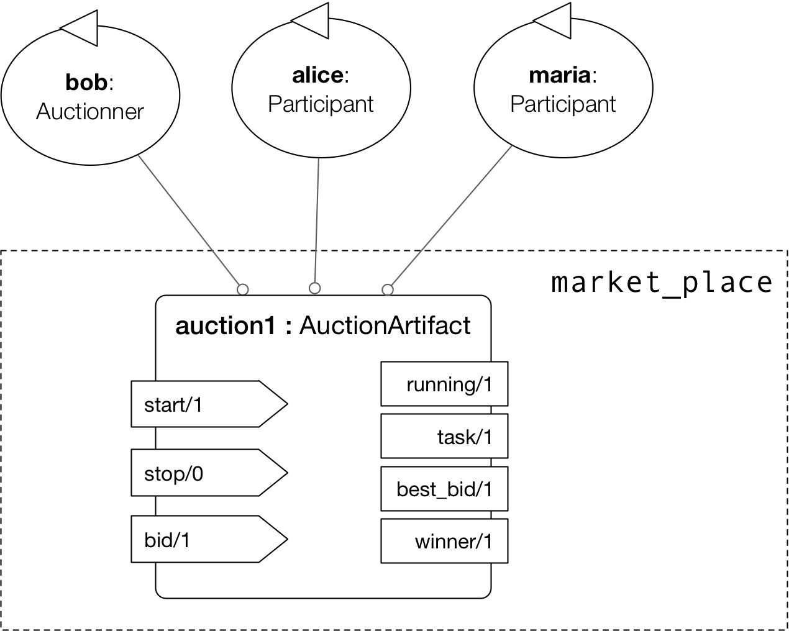
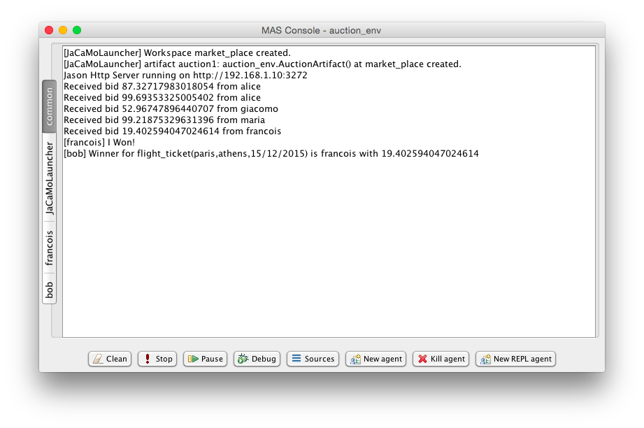
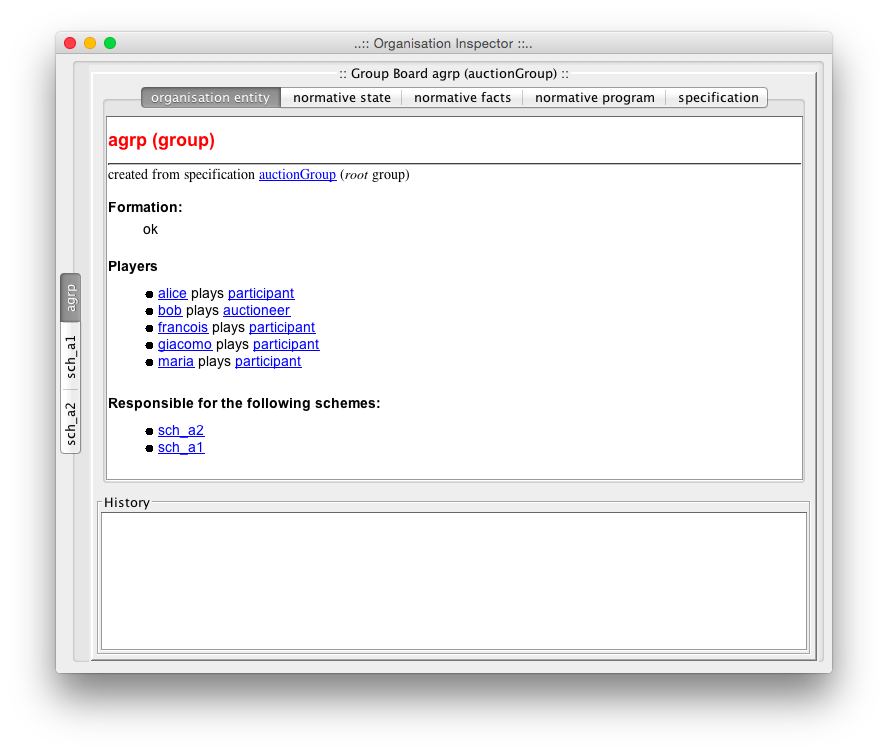
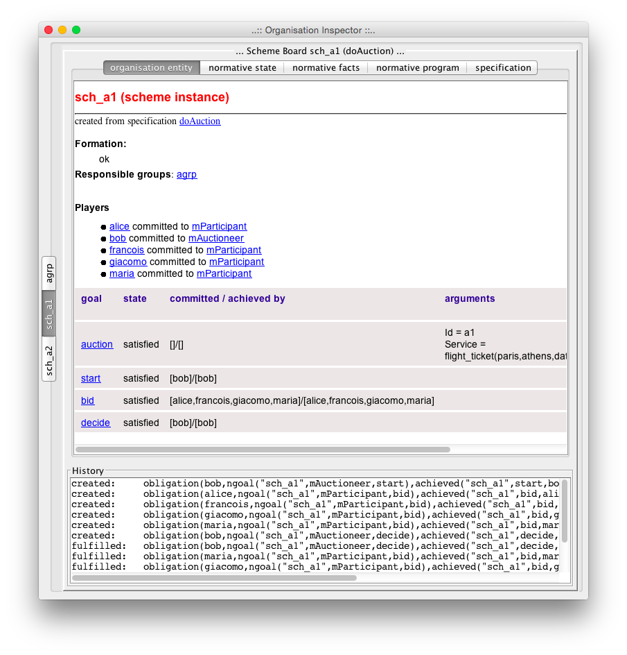

= Playing with Dimensions of Coordination
JaCaMo Team
:toc: right
:source-highlighter: pygments
:pygments-style: jacamo
:pygments-linenums-mode: inline
:icons: font
:prewrap!:

ifdef::env-github[:outfilesuffix: .adoc]

== Introduction

This programming tutorial illustrates different approaches to coordinate agents in JaCaMo. Since JaCaMo is a multi-dimensional programming platform, we can develop the coordination part of our system focusing on agent, environment or organisation dimensions. For instance, we can conceive the coordination based on interaction by direct message passing as usual in MAS, we can use the environment as a coordination medium, or declare the coordination strategies within organisation specifications.

During the tutorial we will develop many versions of a simple market place where an agent who wants to buy some product or service, announces its requirements, other agents bid, and the winner is then chosen. We will start with versions based on message exchange (part I), move to versions where a suitable environment is added (part II), and finish with an auction MAS based on organisation programming (part III). Although the coordination requirements for the market place application are quite simple, we can highlight the differences, advantages, limitations, .... of each coordination approach.

We suppose you have already followed some more introductory tutorials as http://jacamo.sourceforge.net/tutorial/hello-world[hello world], http://jacamo.sourceforge.net/tutorial/gold-miners/[gold miners], and http://jason.sourceforge.net/mini-tutorial/hello-bdi/[BDI intro]. (The application developed in the hello world tutorial is used in some exercises of this tutorial.)

== Part I (message oriented coordination)

The coordination in a market place can follow different protocols, here we will consider a simple _auction protocol_ and its implementation based on message exchanges:

1.  An auctioneer broadcasts a message with his requirements,
2.  Participants send him back messages with the prices, and
3.  The auctioneer broadcasts the winner.

Our first implementation has 5 agents:

* `bob` (auctioneer): the agent is interested in buying a flight ticket from Paris to Athens.
* `francois`, `alice`, `maria`, and `giacomo` (participants): travel agency agents.

The following steps will implement this system.

*1.* Create a new JaCaMo project called `auction_ag` with the following project file content:

[source,jacamoproject,linenums]
.auction_ag.jcm
-----------------------------------
mas auction_ag {

    agent bob: auctioneer.asl

    agent alice   : participant.asl
    agent maria   : participant.asl
    agent francois: participant.asl
    agent giacomo : participant.asl
}
-----------------------------------

*2.* The agent code for the participants is:

[source,jasonagent,linenums]
.participant.asl
--------------------------------------------------------------------------------
+auction(service, D)[source(A)] <- .send(A,tell,bid(D, math.random * 100 + 10)).

{ include("$jacamoJar/templates/common-cartago.asl") }
{ include("$jacamoJar/templates/common-moise.asl") }
{ include("$jacamoJar/templates/org-obedient.asl") }
--------------------------------------------------------------------------------

By this plan, each time the participant gets an event corresponding to
the creation of an auction belief for a `service`, it sends back a bid
with a random price. Notice that `service` (after `+auction(`) is not a
variable, so this agent will only respond to auctions for services. The
variable `D` is bound to the description of the service and variable `A`
is bound to the source of the perception (Bob in our case). The message
has the format `bib( <service description>, <price>)`.

*3.* The agent code for `bob` is

[source,jasonagent,linenums]
.auctioneer.asl
------
!start. // initial goal

+!start <- .broadcast(tell, auction(service, flight_ticket(paris,athens,"15/12/2015"))).

+bid(Service, _)     // receives bids and checks for new winner
   :  .findall(b(V,A),bid(Service,V)[source(A)],L) & // <1>
      .length(L,4)   // <2>
   <- .min(L,b(V,W));
      .print("Winner for ", Service, " is ",W," with ", V);
      .broadcast(tell, winner(Service,W)).

{ include("$jacamoJar/templates/common-cartago.asl") }
{ include("$jacamoJar/templates/common-moise.asl") }
{ include("$jacamoJar/templates/org-obedient.asl") }
------
<1> `L` is a list of all bids, e.g. `[b(77.7,alice), b(91.7,giacomo), ...]`
<2> all 4 expected bids have been received, announce the winner

This agent has an initial goal `start` that is achieved by broadcasting
an auction announcement. The message content has the form
`auction(<type>, <description>)`.

The second plan (that starts with `+bid ....`) deals with received bids.
Bids are sent to `bob` by `tell` messages (see code of participants) and
thus are represented as beliefs in his mind. This can be seen in mind
inspector after the execution (notice the annotation `source` of the
beliefs):

Each belief addition produces an event like `+bid(<service>,<price>)`
that is handled by the plan `pb1`. If the agent has already received 4
bids for this service, the winner is announced. The internal actions
`.findall`, `.length`, and `.min` are described in
http://jason.sourceforge.net/api/jason/stdlib/package-summary.html#package.description[Jason API].

*4.* The execution of the application will look like the following
screen:

image:./screens/r1.png[image]

*5.* To launch two auctions concurrently, we can simply change the plan
for the goal `start` to:

[source,jasonagent]
------
+!start
   <- .broadcast(tell, auction(service, flight_ticket(paris,athens,"15/12/2015")));
      .broadcast(tell, auction(service, flight_ticket(athens,paris,"18/12/2015"))).
------

Notice that plans in `bob` and participants are triggered by events
(`+bid`, `+auction`) and executed _concurrently_. Participants can
produce bids concurrently. Bob can receive bids concurrently.

=== Exercises

a) Bob waits for exactly 4 bids! It is far from a good design choice:
(i) the number of participants may be unknown and (ii) some of them may
not respond. Change the program `auctioneer.asl` so that a decision is
taken after 10 seconds, regardless of the number of bids.

_Hint_: The internal action
http://jason.sourceforge.net/api/jason/stdlib/at.html[`.at`] can be used
to produce a goal after some time. For example,
`.at("now + 10 seconds", { +!decide } )` will create a new goal `decide`
after 10 seconds.

_Solution_: available link:./solutions/timeout_auctioneer.asl.txt[here].

b) Change the code of participants so that they use broadcast to
announce their bids (like an auction room).

_Solution_: available link:./solutions/participant.asl.txt[here].

c) In auction room of the previous exercise (`b)`), agents can listen
the bids done by other agents. Change the code of the agent `giacomo` so
that as soon as he listens a bid from another agent, he bids the same
service with a better price.

_Solutions_: available link:./solutions/winner_participant.asl.txt[here]
and link:./solutions/winner_participant2.asl.txt[here]. (What is the
advantage of the second solution?)

d) Based on the number of running auction _a_ and participants _p_, how
many messages are sent in the broadcast version developed in these
exercises?

_Solution_: available link:./solutions/nb_msgs.txt[here].

(All the code of the project for this part of the tutorial is available
link:./code/auction_ag.zip[here].)

e) You can use the Jade Platform as the agent communication platform by
simply adding `platform: jade()` at the end of the project file
(`auction_ag.jcm`). Test and use the Sniffer agent of the Jade platform
to see and inspect the messages that are exchanged in the system.

_Hint_: see the
http://jason.sourceforge.net/mini-tutorial/jason-jade/[JADE Tutorial].

f) (*hard*) Develop a system where different agents propose different
kinds of services, where some agents are interested in buying one set of
services, other agents are interested in buying a different set of
services. Use the Jade directory facilitator service to implement this
matching between services and agents so that agents can directly
announce auctions to the interested agents instead of broadcasting to
all.

g) (*hard*) Add a Jade agent that plays participant in the MAS
developed so far so that the system has Jason and Jade agents.

h) (*hard*) Implement a version of the MAS as proposed in the JaCaMo
hello world
http://jacamo.sourceforge.net/tutorial/hello-world/[tutorial] where the
coordination required to print "hello world!" is implemented by message
exchanges instead of an organisation. Considers two approaches:

* with a new coordinator agent that allocates subtasks to agents
accordingly,
* without a centralised coordinator (keeping the same set of agents as
in the hello world tutorial).

== Part II (environment oriented coordination)

Instead of using message exchanges among the agents, in this part of the
tutorial we will enrich the agents' _environment_ with artifacts that
will help the coordination required for the market place auction
protocol. The speech acts will be replaced by a simpler form of
interaction: perception and action. Instead of implementing the auction
protocol within the agents' code as done in the previous part, we will
externalise and encapsulate the coordination mechanism within an
_auction artifact_ shared between the agents. Thanks to the abstractions
provided in JaCaMo we can also situate this artifact in a workspace,
duplicate it, and control its access.

Each auction is managed by one artifact instance where:

1.  The auctioneer starts the auction setting the service description,
2.  The participants perceive the service and likely do their bids,
3.  After some time, the auctioneer stops the auction and the winner is
defined.

This auction artifact has the following observable properties:

* the service (or task) description,
* the current best bid,
* the current winner (shown only when the auction has finished),
* whether the auction is running or not,

and the following operations:

* start(task_description),
* stop, and
* bid(value).

The specification of this artifact is depicted below.

The following steps will implement this MAS.

*1.* Create a new JaCaMo project called `auction_env` (for now, leave
the default configuration in the `.jcm` file) and create also a new
artifact, called `AuctionArtifact` (select `src/env`, menu
File -> New -> CArtAgO Artifact). Replace the Java code of the artifact by:

[source,java]
.AuctionArtifact.java
----
include::code/auction_env/src/env/auction_env/AuctionArtifact.java[]
----

*2.* In the project file, create a workspace with an
instance of the above artifact and the same agents as before:

[source,jacamoproject]
.auction_env.jcm
------------------------------------------------------------
mas auction_env {

    agent bob     : auctioneer.asl

    agent alice   : participant.asl
    agent maria   : participant.asl
    agent francois: participant.asl
    agent giacomo : participant.asl

    workspace market_place {
        artifact auction1 : auction_env.AuctionArtifact() {
            focused-by: bob, alice, maria, francois, giacomo
        }
    }
}
------------------------------------------------------------

*3.* The code of the `auctioneer.asl` is:

[source,jasonagent]
------------------------------------------------------
!start. // initial goal

+!start
   <- start("flight_ticket(paris,athens,15/12/2015)");
      .at("now + 10 seconds", {+!decide}).

+!decide
   <- stop.

+winner(W) : W \== no_winner
   <- ?task(S);
      ?best_bid(V);
      .print("Winner for ", S, " is ",W," with ", V).

{ include("$jacamoJar/templates/common-cartago.asl") }
{ include("$jacamoJar/templates/common-moise.asl") }
{ include("$jacamoJar/templates/org-obedient.asl") }
------------------------------------------------------

and the `participant.asl` is:

[source,jasonagent]
--------------------------------------------------------
+task(D) : running("yes") <- bid(math.random * 100 + 10).

+winner(W) : .my_name(W) <- .print("I Won!").

{ include("$jacamoJar/templates/common-cartago.asl") }
{ include("$jacamoJar/templates/common-moise.asl") }
{ include("$jacamoJar/templates/org-obedient.asl") }
--------------------------------------------------------

Notice that operations and observable properties of the
`AuctionArtifact` are mapped respectively to agents' actions and
beliefs.

*4.* The execution should produce a similar result as the message based
version:

*5.* The above solution lacks some flexibility, since the number of
auction artifacts is pre-defined in the `.jcm` file. We will change it
so that Bob will create the artifacts on demand.

Change the workspace definition as follows:

[source,jacamoproject,linenums]
.JCM project
----
include::code/auction_env/auction_env.jcm[]
----

so that the artifact is no more created when the application is started.
The artifact will be created by Bob in its new `start` plan:

[source,jasonagent]
.auctioneer.asl
----
include::code/auction_env/src/agt/auctioneer.asl[]
----

The participants programs is now:

[source,jasonagent]
.participant.asl
----
include::code/auction_env/src/agt/participant.asl[]
----

=== Exercises

a) What is the _main_ difference between the implementations of part I
and II of this tutorial?

b) Run two sequential auctions using the same `a1` artifact.

c) (*hard*) Run two parallel auctions.

_Hint_: Annotations could be used to discover from which artifact the
information is coming. For instance

[source,jasonagent]
------------------------------------------------------------
+task(D)[artifact_id(AId)] : running("yes")[artifact_id(AId)]
   <- bid(math.random * 100 + 10)[artifact_id(AId)].
------------------------------------------------------------

will ensure that the bid action will be done in the same artifact where
the task was perceived.

_Solution_: all the code of the project for this part of the tutorial is
available link:./code/auction_env.zip[here].

d) Change the auction protocol so that the bids are perceived by the
participants. In general, if we need to change the protocol, which part
of the MAS implementation should we change?

e) (*hard*) Develop an artifact that works as a kind of yellow pages
for the system.

f) (*hard* ) Implement a version of the MAS as proposed in the JaCaMo
hello world
http://jacamo.sourceforge.net/tutorial/hello-world/[tutorial] where the
coordination required to properly print "hello world!" is implemented by
means of the environment (without organisation, but keeping the
`GUIConsole` artifact).

== Part III (organisation oriented coordination)

In this part of the tutorial we use an organisation specification to
coordinate the agents interacting all together in the environment using
the auction artifact as interaction medium for bidding in a market
place. The coordination strategy is specified through a normative
organisation composed of only one _group type_ (identified as
`auctionGroup`) in which two _roles_ can be played by agents:

* auctioneer and
* participant.

For this group to be well formed (and then be responsible for a scheme),
at least one agent must play the auctioneer role. The _goals_ to be
achieved under this structure are specified within a social _scheme_
(identified as `doAuction`). They are:

1.  `start`: starting the auction process,
2.  `bid`: proposing a bid,
3.  `decide`: deciding who is the winner of the auction.

These goals should be achieved exactly in the order they are presented above, i.e. the decision should be taken after the bids that should be proposed after the start.

Finally the normative specification declares the set of duties and permissions that agents will have to fulfil while playing some roles in the group. The norms are the following:

* `auctioneers` are _permitted_ to achieve `start` and `decide`,
* `participants` are _obliged_ to achieve `bid`.

The goals `start` and `decide` are thus part of the same mission `mAutioneer`, and `bid` is part of the mission `mParticipant`. This specification is depicted below in the Moise notation.

image:./code/os.png[]

The following steps will implement this MAS.

*1.* In Eclipse, copy the project `auction_env` into a new project
called `auction_org` and create an organisation, called `auction-os.xml`
(select `src/org`, menu File -> New -> Moise Organization). Replace the XML
code by:

[source,xml]
.auction-os.xml
----
include::code/auction_org/src/org/auction-os.xml[]
----

Notes:

* The goals `start`, `bid` and `decide` are defined as sub-goals of the
goal `auction`.
* The `auction` goal has two arguments: the auction identification and
its description.
* Some goals have a deadline (`ttf` = time to fulfil).

*2.* Rename the file `auction_env.jcm` to `auction_org.jcm` and edit it
so that one instance of the `auctionGroup` is created:

[source,jacamoproject]
.auction_org.jcm
----
include::code/auction_org/auction_org.jcm[]
----

Notice that no social scheme is created in the `.jcm` project, they will
be created by Bob at runtime whenever he wants to start an auction. One
scheme instance will be created for each running auction and all these
schemes are under the responsibility of the same group instance, i.e.
the one created from the `.jcm` project. (Of course other configurations
are possible. For example, we can have one group instance for each
scheme instance. We leave this alternative solution as an exercise.)

*3.* The behaviour of Bob (file `auctioneer.asl`) needs to be changed to
consider the organisation.

* To start an auction, Bob will instantiate a scheme and commit to the
mission `mAuctioneer` there.
* Plans for the organisational goals `start` and `decide` have to be
included. These plans are quite similar to the previous plans.

[source,jasonagent]
.auctioneer.asl
----
include::code/auction_org/src/agt/auctioneer.asl[]
----
<1> No need to broadcast the focus to the agents, the organisation will signal the participants about their goals.
<2> We do not need create the goal `decide` anymore, it is now a goal in the organisational scheme.

While the plan for the event `+winner(W)` is the same as in the
environment oriented coordination (Part II), the plans for `+!start` and
`+!decide` were changed. The coordination implied by the broadcast
`(*1*)` and the `.at( ... decide...)` `(*2*)` are not necessary anymore.
The organisation monitoring facilities of the JaCaMo platform will
signal to the agents about their goals at the moment they should achieve
them. So the participants will have an event `+!bid` when they should
bid (i.e. as soon as the goal `start` is satisfied), when all of them
have bid, the event `+!decide` is created for Bob (because of his roles
and missions).

NOTE: The phases of the auction protocol are not controlled by Bob anymore!
The organisation takes care of it. Changes on protocol, should be done
in the organisation specification, and not in the code of the agents.

The program of the participants also need to be
changed to achieve organisational goals:

[source,jasonagent]
.participant.asl
------
+!bid[scheme(Sch)]
   <- ?goalArgument(Sch,auction,"Id",Id);
      lookupArtifact(Id,ArtId);
      focus(ArtId);
      .wait( (math.random * 5+1)*1000);      // to simulate some "decision" reasoning
      bid(math.random * 100 + 10)[artifact_id(ArtId)].

+winner(W) : .my_name(W) <- .print("I Won!").

{ include("$jacamoJar/templates/common-cartago.asl") }
{ include("$jacamoJar/templates/common-moise.asl") }
{ include("$jacamoJar/templates/org-obedient.asl") }
------

*4.* The execution output is:

image:./screens/r3.png[image]

It is also interesting to inspect the mind of the agents to see the
beliefs produced by the organisational artifacts (specially the belief
`goalState` used in the `.asl` programs). (The complete description of
the observable properties of organisational artifacts are found
http://moise.sourceforge.net/doc/ora4mas/[here] -- follow the links
Group and Scheme API.)

image:./screens/mi2.png[image]

*5.* Now that we have a first version of the coordination of the market
place running, we will start to change it taking profit of its
declarative nature and organisational abstractions.

Suppose that Bob wants to take a decision as soon as the auction has two
bids, he does not want to wait for all participants. To implement this,
we can simply change the cardinality of the goal bid in the social
scheme definition of the organisational specification (file
`auction_os.xml`):

------------------------------------------------
       <goal id="bid" ttf="10 seconds" min="2"/>
------------------------------------------------

*6.* We can also exploit how to monitor and regulate the agents
behaviour taking profit of the normative dimension of the organisation.
Let's consider that some participants do not bid (even if they are
obliged to do so). To simulate that, the program `participant.asl` can
be changed to:

[source,jasonagent]
.participant.asl
----
include::code/auction_org/src/agt/participant.asl[]
----

And remove the `min=2` in goal `bid` (file `auction_os.xml`).

In the execution, the scheme does not progress to the `decide` phase,
since the organisation is waiting for the bids (the goal `bid` is
enabled and the goal `decide` is waiting):

image:./screens/r4.png[image]

Hence the goal `bid` has a deadline, after 10 seconds the organisation
informs the agents that some obligations was not fulfilled (see the
inferior part of the above screen). Bob can react to these events
putting those agents in a black list (not implemented here) and setting
the goal `bid` as satisfied anyway. The following plan will do that for
Bob:

[source,jasonagent]
-------
+oblUnfulfilled( obligation(Ag,_,done(Sch,bid,Ag),_ ) )[artifact_id(AId)]  // <1>
   <- .print("Participant ",Ag," didn't bid on time! S/he will be placed in a blacklist");
       // TODO: implement a black list artifact
       admCommand("goalSatisfied(bid)")[artifact_id(AId)].
-------
<1> it is the case that a bid was not achieved

The code of the project for this part of the tutorial is available
link:./code/auction_org.zip[here].

=== Exercises

a) Implement an agent that bids and then tries to achieve the goal
`decide` -- violating thus the auction protocol. What happens?

_Hint_: the action `goalAchieved(decide)[artifact_name(Sch)]` informs
the organisation scheme (identified by the variable `Sch`) that the goal
`decide` was achieved by the agent performing the action.

_Solution_: available link:./solutions/exercise3a.asl.txt[here].

b) Implement an agent that tries to commit to both missions. Explain
the result of the execution.

_Solution_: available link:./solutions/exercise3b.asl.txt[here].

c) Implement an agent that tries to adopt both roles. Explain the
result of the execution.

_Solution_: available link:./solutions/exercise3c.txt[here].

d) Use the same source code (the `.asl` file) for all agents of the
system. Their goals should be defined either by the organisation or the
project file.

_Hint_: initial goals can be given to agents in the project as follows:

[source,jacamoproject]
------------------------------------------------------------------------------
    agent bob : auctioneer.asl {
        goals: do_auction("a1","flight_ticket(paris,athens,date(15,12,2015))")
               do_auction("a2","flight_ticket(athens,paris,18/12/2015)")
    }
------------------------------------------------------------------------------

_Hint_: if a plan should be executed only the auctioneer, the context of
the plan can be used, as in the following example:

[source,jasonagent]
-------------------------------------------------------------------------------------------
+oblUnfulfilled( obligation(Ag,_,achieved(Sch,bid,Ag),_ ) )[artifact_id(AId)]
   : .my_name(Me) & play(Me,auctioneer,_)  // handle unfulfilled obl if I am the auctioneer
   ...
-------------------------------------------------------------------------------------------

_Solution_: link:./solutions/auction_capabilities.asl.txt[agent
program], link:./solutions/auction_org.jcm.txt[project file].

e) Implement the black list artifact for the step *6.*

f) Keeping the organisation, replace the auction artifact by messages,
as used in the part I of this tutorial.

g) Evaluate the different solutions for the auction protocol
considering

* open system, where the set of agents is unknown at design time,
* centralisation, and
* performance.

_Some ideas_: link:./solutions/eval.html[here].

'''''
