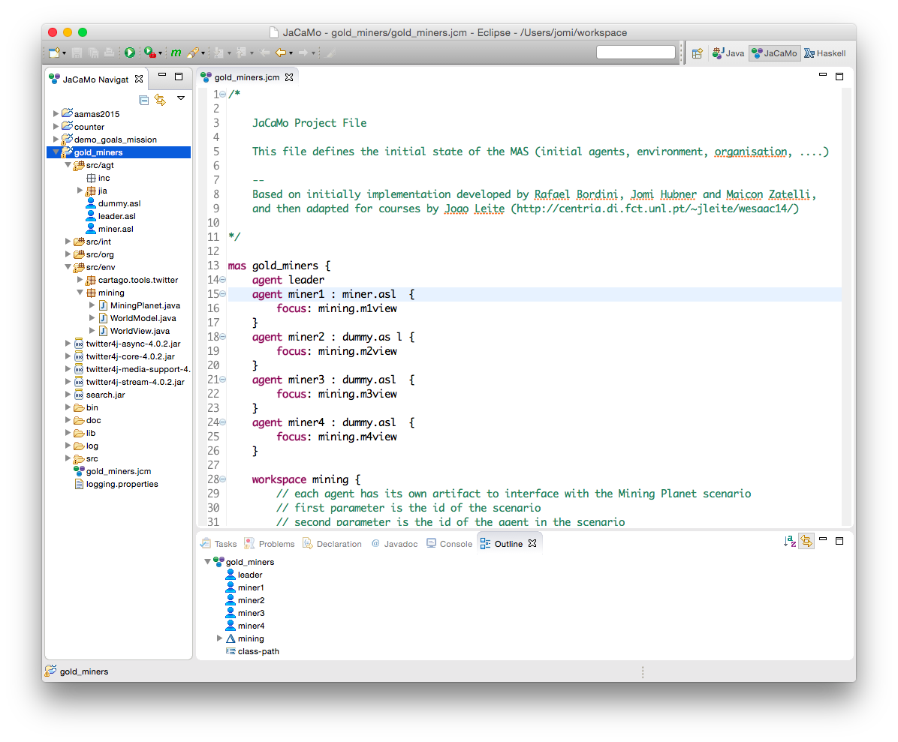
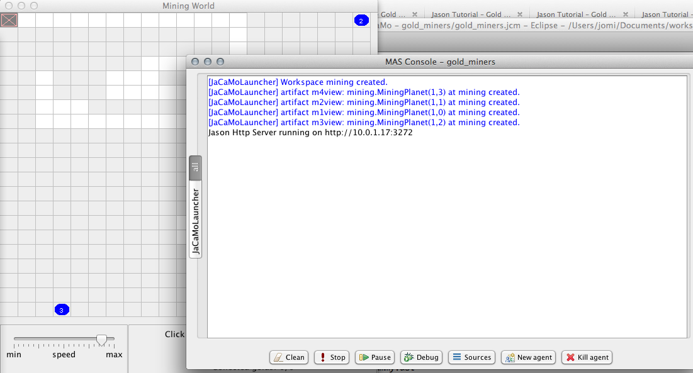

= Gold Miners
Agent Programming Tutorial using JaCaMo
September 2014
:toc: right

:prewrap!:

image::./screens/gold-miners.png[align=center,width="70%"]

== Introduction

This programming exercise will illustrate some of the features of Jason, Agent Programming Language of JaCaMo, through the development and refinement of the Gold Miners implementation.

In each of the following items, we start with a general description and its objective, a description of the setting to test the exercise, followed by some brief explanation of the steps involved in achieving it and some hints on how to do it. Depending on your programming experience, you may decide to only read the introduction and objective to develop your own original solution, or also read the explanation and hints.

This tutorial was initially developed by _João Leite_ (http://centria.di.fct.unl.pt/~jleite/wesaac14/) based on the Jason
Gold Miners implementation (which is available together with Jason distribution).

The slides used at http://altissimo.cs.pub.ro[ALTISSIMO] are found http://jacamo.sourceforge.net/tutorial/gold-miners/aop-altissimo-14.pdf[here].

== Part I

To get started, you can install the http://jacamo.sourceforge.net/eclipseplugin/tutorial/[JaCaMo eclipse plugin] (or other IDE http://jacamo.sourceforge.net/doc/install.html[option]) and download the initial JaCaMo project from http://jacamo.sourceforge.net/tutorial/gold-miners/initial-gold-miners.zip[here]. Then, after unziping it into some directory, open Eclipse and import the downloaded project (File -> Import -> JaCaMo Project -> Pick directory -> Select Project GoldMiners). You will have a screen like

Take a few minutes to understand the application. Read the PDF files in the `doc` folder and the source code `miner.asl`.

Run the application using environment id=1; 1 leader; 1 miner; 3 dummies (the .jcm file already encodes this configuration). The screen will be like

Note: the type of environment id=1, 2, 3, ... is changed by changing the first parameter when creating the artifact `MiningPlanet` in the .jcm file:

You can also open a browser at http://localhost:3272 and inspect the mind of the agents.

image::./screens/s6.png[]

=== Exercise a)

_Introduction_: To help understand what is going on, and what the agents are doing, it is useful to have agents printing messages on the console. This is particularly useful when agents are moving to random positions that we cannot anticipate.

_Objective_: modify the current miner.asl specification file in a way
that the miners print a message on the console announcing the location
they randomly picked to go near.

_Test_: environment id=1;leader;miner;dummy;dummy;dummy

_Description_: the objective can be accomplished by changing the plan
where the next location is chosen, to include an additional action
that prints the desired message.

NOTE: recall that there is an internal action `.print(term1,term2,...)`.

_Solution_: available link:./solutions/minerA.asl[here].

=== Exercise b)

_Introduction_: One of the reasons why the miner is going near a cell,
and not to a cell, is because it may happen that the randomly chosen
cell is not reachable, e.g. because there are walls blocking any path
to it. The current implementation already deals with this by adding
the belief `near(X,Y)` whenever the agent cannot reach the cell, or
whether it is already in the vicinity. However, we are not aware of
which of these two reasons actually happened.

_Objective_: modify the current miner.asl specification file in a way
that the miners print a message on the console announcing either that
they have reached the neighborhood of the target cell, or that the
target cell is not reachable, depending on what is the actual cause.

_Test_: environment id=2; leader;miner;dummy;dummy;dummy

_Description_: the objective can be accomplished by changing the plans
for the goal `near(X,Y)` so that the specific message is executed.

TIP: you might have to split one of the plans in two, so that you can differentiate the context, on which the message to be printed depends.

_Solution_: available link:./solutions/minerB.asl[here].

== Part II

With the previous implementation, the miner was not really mining. It was only wondering around. You can see for yourself by trying it with environment id=3.  If you now use the file link:./solutions/miner1.asl[miner1.asl] instead, you will see that
several plans have been added to deal with the mining of gold. Take a few minutes to understand the new `miner1.asl` file. Most parts are commented to help you understand. Try it with environment `id=3;leader;miner1;dummy;dummy;dummy`. You can use mouse clicks to add new pieces of gold in the scenario.

NOTE: if you simply copied the code of miner1.asl into your previous miner.asl agent, then the configuration should refer to miner and not miner1. From now on, we will assume that you have copied the code in miner1.asl into your miner.asl file.

=== Exercise c)

_Introduction_: Whereas so far we have only considered one miner, the
miner will have to share its environment with other agents specialized
in picking up gold and dropping it on the depot. To know who drops
more gold pieces on the depot, we will trust agents to keep note of
how many gold pieces they have dealt with.

_Objective_: modify miner.asl specification file in a way that the
miner knows, at each point of its execution, how many gold pieces it
dropped on the depot.

_Test_: environment id=3; leader;miner;miner;miner;miner.

_Description_: the objective can be accomplished by maintaining a
belief whose argument is the number of gold pieces dealt with. You
should start by creating an initial belief (e.g. `score(0)`). Then, this
belief should be updated to reflect the gold pieces successfully
dropped on the depot. This can be done as part of the plan to the goal
`handle(gold(X,Y))`.

TIP: to update the existing belief `score(X)` with a new score
`score(Y)` you can use `-+score(Y)`.

_Solution_: available link:./solutions/minerC.asl[here].

=== Exercise d)

_Introduction_: As you can see, the current implementation of the
miner agent has, hardwired, the location of the depot (reflected by
the 0,0 in the plans for handling and dropping gold). However, with
the exception of the first three scenarios, the depot is not at the
location (0,0). In fact, the environment initially sends all agents
the location of the depot which is kept as a belief of the form
`depot(_,X,Y)`, representing that the depot is at location `X`,`Y`. We
will want the miners to be able to perform in environments where the
depot is at an arbitrary location.

_Objective_: modify the current miner.asl specification file in a way
that the miner can operate in environments where location of the depot
is not known in advance.

_Test_: environment id=4; leader;miner;miner;miner;miner

_Description_: the objective can be accomplished by changing the plans
to handle and drop gold so that they check the belief base for the
right coordinates for the depot, instead of using (0,0).

TIP: you can include a query to the belief base in the context of the plan, or a test goal, to find out the right coordinates of the depot.

_Solution_: available link:./solutions/minerD.asl[here].

== Part III

You may have noticed that the multi-agent system has an agent named
leader, which has yet to have an active participation. Whereas in a
full-fledged implementation of a team of agents it could serve as the
coordinator, here we will simply use it to illustrate communication
between agents.

=== Exercise e)

_Introduction_: If you inspect the file leader.asl, you will realize
that the leader has a plan to handle messages from the agents
informing it that they have dropped gold, keeping every agent's
score. According to the plan, every time the leader receives a message
from the miners telling it that they dropped some gold at the depot,
the leader updates the score of the agent and prints a
message. However, right now, the miners are not sending the leader any
messages!

_Objective_: modify the current miner.asl specification file in a way
that miners send the leader a message informing it whenever they
dropped some gold.

_Description_: the objective can be accomplished through the
modification of the plan to handle gold, adding the action to send the
desired message.

NOTE: recall the existence of the action `.send(Receiver, Type, Content)` where `ToAgent` is the name of the destination agent, `Type` is the kind of message and `Content` its content (e.g. if `Sender` sends such a message with `Type=tell`, the effect is the addition of `Content[source(Sender)]` to the belief base of the `Receiver`, thus generating the corresponding event). You can use the mind inspector (http://localhost:3272) to see whether the leader is receiving the messages.

_Solution_: available link:./solutions/minerE.asl[here].

=== Exercise f)

_Introduction_: Despite the fact that the leader keeps the scores, we
do not know who is winning.

_Objective_: modify the current leader.asl specification file in a way
that every time there is a new agent leading in number of gold pieces
dropped, it prints a message informing who the agent is and how many
gold pieces it has dealt with.

_Description_: the objective can be accomplished through the
modification of the leader plan to handle the new belief dropped,
considering the case where there is a new winning miner and the case
where the winning miner did not change.

TIP: keeping a belief of the form `winning(agent_name,score)` might make it easy to determine when a new message informing of a newly dropped piece of gold causes a change in the winning agent.

_Solution_: available link:./solutions/leaderF.asl[here].

=== Exercise g)

_Introduction_: We know (through the console) who is winning, but the
agents still do not know.

_Objective_: modify the current leader.asl specification file in a way
that every time there is a new winning agent, it broadcasts a message
to every agent.

_Description_: the objective can be accomplished through the
modification of the leader plan to handle the new belief dropped.

NOTE: recall the existence of the action `.broadcast(Type, Content)` which acts as the action `.send`, except that the message is sent to every agent.

_Solution_: available link:./solutions/leaderG.asl[here].

=== Exercise h)

_Introduction_: Now we want the winning miner to brag about it.

_Objective_: modify the current miner.asl specification file in a way
that every time a miner receives a message telling it that it is the
now winning, it prints a message bragging about it.

_Description_: the objective can be accomplished through the addition
of a suitable plan to handle the new belief resulting from the message
broadcasted by the leader.

TIP: the internal action `.my_name(X)` instantiates `X` with the agent's name.

_Solution_: available link:./solutions/minerH.asl[here].

== Part IV
*[Bonus]*

=== Exercise i)

_Introduction_: The way the `miner.asl` specification was implemented is
not very efficient because it is too committed to picking up some gold
piece, neglecting any gold pieces it finds on its way. It is often the
case that a miner walks by a gold piece and doesn't pick it up, simply
because it is set to go and pickup another one.

_Objective_: modify the current `miner.asl` specification file in a way
that miners pick up a gold piece if it is located in its cell, even if
it is on its way to picking up another one.

_Description_: the objective can be accomplished through the addition
of a suitable plan to handle the new event of the form
`+cell(X,Y,gold)` when the agent is not carrying gold, but it is also
not free.

NOTE: this is a more advanced problem. The miner will have to
determine its current desire (the internal action
`.desire(handle(gold(X, Y)))` to query the current desires can help) and determine whether the new gold is closer than the one in the current desire. Then, if it is, the miner should drop the current desire (`.drop_desire(handle(gold(X, Y)))`) and adopt a new goal.

_Solution_: available link:./solutions/minerI.asl[here].

In the http://jason.sf.net[Jason] distribution file you will find a more detailed (and efficient) implementation of the miners team.

=== Exercise j)

Alternative solution for exercise f): to post a message at Twitter
announcing the current winner.

The following steps will prepare the environment for the leader to
access the twitter.

.  Go to your Twitter account and create an application (it is a simple form): https://apps.twitter.com/app/new.

. Go to the "permission tab" and change it to "read and write". The API tab will show important parameters for the next step.

. Add an artifact responsible for interacting with Twitter in the  .jcm file (replace the four parameters by the values given by Twitter in the "API tab" above):

....
workspace web {
   artifact tweetTool : cartago.tools.twitter.Twitter("your API key","your API secret", "your Access token", "Access token secret") {
      focused-by: leader
   }
}
....

Now you can replace the print message in the leader (solution of exercise f) by a tweet! The above artifact provides the action
`tweet(M)`, where `M` is a string to be posted at Twitter. The
`.concat` internal action is quite useful to compose the string, see documentation http://jason.sourceforge.net/api/jason/stdlib/concat.html[here].

== Part V

This part of the tutorial revisit the agent concepts and their
relation with the programming language.

=== Agent definition

Considering the usual definition of agent as

"An intelligent agent is a computer system capable of *flexible*
autonomous action in some environment. +
Flexible = reactive, pro-active, social"
-- Wooldridge

How do you evaluate the behaviour of the miner agents regarding this
definition? Are the agents reactive, pro-active, social, autonomous?

=== BDI agents

. Where in the code of the agent we can see the BDI concepts?

. Can a Jason agent handle its own intentions? Where in the source code of the miners it can be noticed?

. How the _practical reasoning_ (deliberation, means-ends, ...) is implemented in Jason? And the _theoretical reasoning_?
