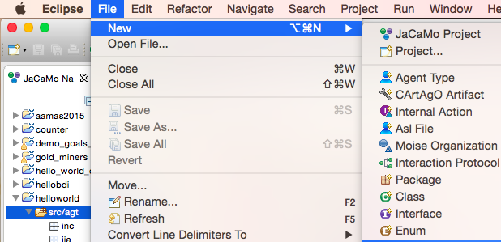
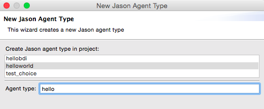
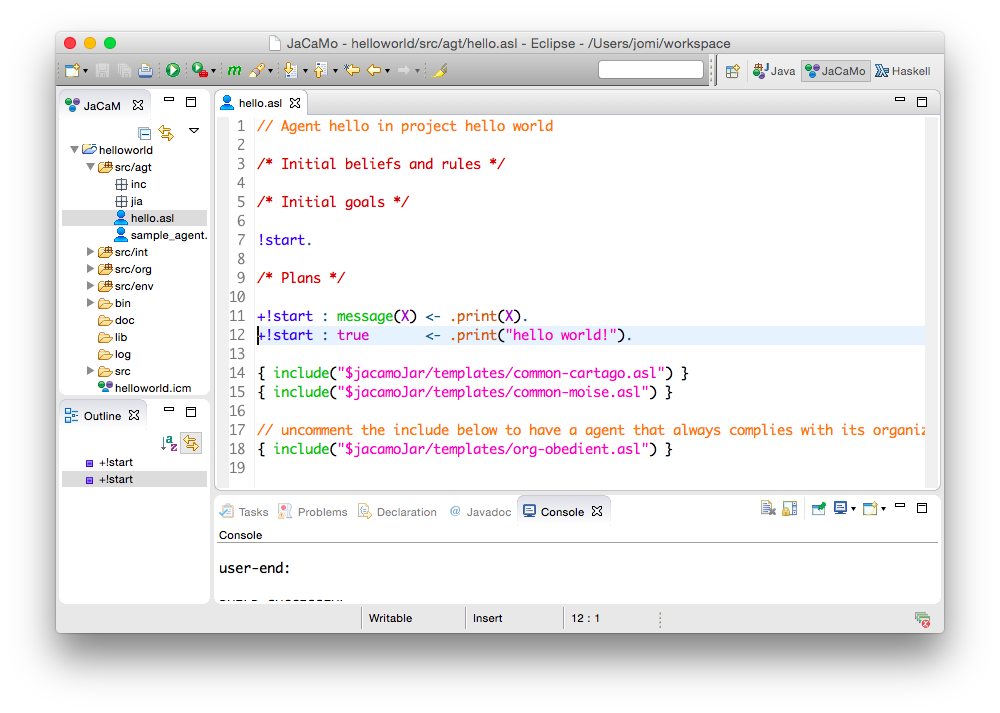
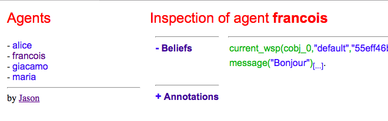
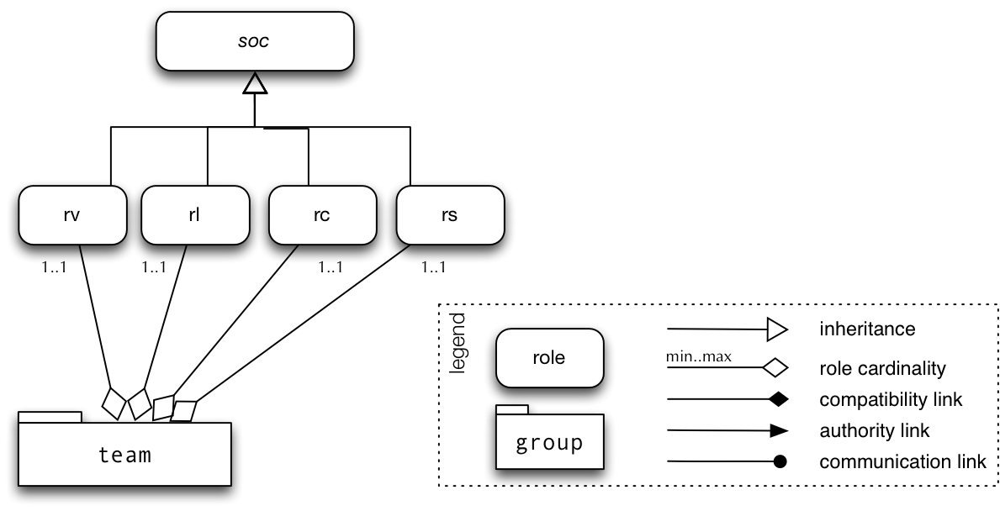
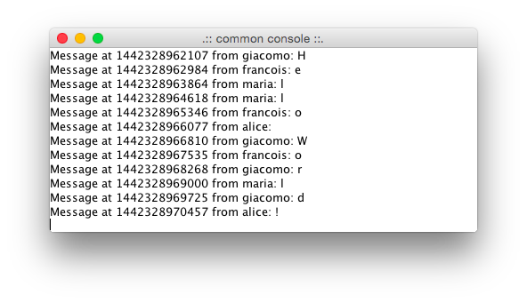

= Hello JaCaMo and Multi-Agent World
Use of the JaCaMo Platform
JaCaMo Team
:source-highlighter: pygments
:pygments-style: jacamo
:pygments-linenums-mode: inline
:toc: right

:prewrap!:

ifdef::env-github[:outfilesuffix: .adoc]

== Introduction

This programming tutorial illustrates some features of JaCaMo through
the development and refinement of a kind of (sophisticated) _Hello World_
application that considers agents, environment and organisation.

== Part I (new project)

Using either the http://jacamo.sourceforge.net/eclipseplugin/tutorial/[JaCaMo eclipse plugin] or a  http://jacamo.sourceforge.net/tutorial/hello-world/shell-based{outfilesuffix}[shell command] (see link:http://jacamo.sourceforge.net/doc/install.html[installation instructions]), create a new project named `helloworld`. The file `helloworld.jcm` (the project file) describes the project and
will be the main focus of this tutorial. By openning this file, you will
have a screen like the following:

image:./screens/p1.png[]

Project files (with extension `.jcm`) allow us to define the agents, the
environment and the organisation of our multi-agent application. The
keywords `agent`, `workspace`, and `organisation` are used to define
these components, respectively. Although the project template explains
its own syntax, it is important to know the conceptual view of JaCaMo to
properly understand this file. The conceptual model is presented in the
http://jacamo.sourceforge.net/[JaCaMo website],
in the https://mitpress.mit.edu/books/multi-agent-oriented-programming[JaCaMo book], in some
link:./slides.pdf[slides], and in some
http://dx.doi.org/10.1016/j.scico.2011.10.004[papers].

NOTE: This tutorial uses JaCaMo 1.0.

[[part-ii-agent]]
== Part II (agent)

Our initial application will have four agents that will print different
hello world messages. The source code for all of them will be the same
(a Jason `.asl` file), but they will have different names and different
initial beliefs.

*1.* To add the four agents, in the project file, replace
`agent sample_agent` by:

[source,jacamoproject]
----------------------------------------
    agent francois : hello.asl {
        beliefs: message("Bonjour")
    }
    agent maria    : hello.asl {
        beliefs: message("Bom dia")
    }
    agent giacomo  : hello.asl {
        beliefs: message("Buon giorno")
    }
    agent alice    : hello.asl {
        beliefs: message("Good morning")
    }
----------------------------------------

The four agents (named `francois`, `maria`, `giacomo`, and `alice`)
share the same program file `hello.asl`, that does not exist yet (it
will be created in the following step). As can be seen in this project
file, each agent will have an initial belief `message("xxxxx")`
corresponding to the message that it should use to say hello.

*2.* To create a new agent type select `src/agt` (in JaCaMo Navigator
tab) and then the Eclipse menu File -> New -> Agent type.

For the agent type, fill "hello" corresponding to the agent's source
code file `hello.asl`:

*3.* Our initial agents will be obedient to everything their
organisation asks for! Thus, uncomment the last line in the file
`hello.asl`. In order to take into account the belief `message`, the
plan to achieve the goal `!start` has to be improved as shown below:

The plan in line 11 on the picture can be read by the agent as "whenever
I have the goal `!start` and I believe in `message(X)`, I will achieve
this goal by doing `.print(X)`. `X` is a variable that gets value by
matching `message(X)` with some agent's belief. If the agent belief is
`message("Bom dia")`, the value of `X` will be "Bom dia".

If the plan in line 11 cannot be used (because the agent does not
believe in `message(X)`), then the plan in line 12 is used.

NOTE: the order of the plans for achieving goal `start` is important. If
you place plan of line 12 before the one in line 11, this latter will
never be executed!

*4.* You can now run the application by pressing on the button
image:./screens/run.png[], the result should be the following in
the `MAS Console` of the project:

image:./screens/r1.png[]

You can use the mind inspector (http://localhost:3272) to see mental
state of the agents when clicking on the agent's name:

[[exercises]]
Exercises
~~~~~~~~~

*a)* Create a new type of agent (called `hello2.asl`) with the following
initial code:

[source,jasonagent]
------------------------------------------------------
msg(fr,"Bonjour").
msg(br,"Bom dia").
msg(it,"Buon giorno").
msg(us,"Good morning").

!start.

{ include("$jacamoJar/templates/common-cartago.asl") }
{ include("$jacamoJar/templates/common-moise.asl") }
{ include("$jacamoJar/templates/org-obedient.asl") }
------------------------------------------------------

Change the .jcm project so that the agent gets an initial belief
`country(.....)`. This belief defines the agent's country (e.g.
`country(it)`). In the jason code of the agent, write a plan for
achieving the goal `start` that considers the `country` belief and the
`msg` predicates defined in the code above.

__Hint__: in the plan's context (what follows `:`) you can use the
operator `&` to write a conjunction of two predicates (e.g.
`belief(X) & X > 10`).

__Solution__: available link:./solutions/e1a.txt[here].

*b)* Add a new agent (called `bob`) in the application based on this new
agent type, that will join the system composed of `alice`, `francois`,
`giocamo` and `maria`.

__Solution__: available link:./solutions/e1b.txt[here].

[[part-iii-environment]]
== Part III (environment)

The environment of this application is quite simple, it has a graphical
display artifact where agents can print messages and perceive the number
of already printed messages. The artifact has thus one observable
property (`numMsg`) and one operation (`printMsg(String)`). Initially
all agents will share the same display artifact and latter we will have
displays in several countries.

*1.* To create the display artifact, select `src/env` (in the JaCaMo
Navigator tab) and then the Eclipse menu File -> New -> CArTAgO Artifact. Fill
the form as follows (NB.: use `display` and `GUIConsole` for the package
and class names, respectively):

image:./screens/f2.png[width="60%", align=center]

Replace the default code of GUIConsole by the Java code available
link:./code/helloworld/src/env/display/GUIConsole.java[here]. Identify in the Java source code
where the observable properties and operations are declared.

*2.* Add this artifact in the project by including the following lines
in the .jcm project:

[source,jacamoproject]
---------------------------------------------------
    workspace jacamo {
        artifact gui: display.GUIConsole("common")
    }
---------------------------------------------------

The above lines create an instance of the display artifact and named it
`gui`. This artifact will be placed in a workspace identified by
`jacamo`.

*3.* In order to perceive this artifact, the agents need to focus on it.
This is why we add for each agent a `focus` instruction focusing on the
artifact `gui` in the workspace `jacamo`:

[source,jacamoproject]
---------------------------------------
    agent francois : hello.asl {
        beliefs: message("Bonjour")
        focus: jacamo.gui
    }

    // ... similar for the other agents
---------------------------------------

In the agent source code (file `hello.asl`), replace the `.print` action
by `printMsg` which is the name of the operation provided by the `gui`
artifact. The agent will thus use the artifact operation instead of the
Jason MAS Console.

[source,jasonagent]
------------------------------------
+!start : message(X) <- printMsg(X).
------------------------------------

NOTE: any action corresponding to the call of an operation on an artifact
doesn't start with a `.`. The actions preceded by a `.` as `.print` are
Jason internal actions.

*4.* The result of the execution should be:

image:./screens/r2.png[width="60%", align=center]

*5.* Instead of having a shared display artifact, we will now create one
display artifact for each country. Since artifacts are inside
workspaces, we will also create a workspace for each
country.footnote:[In this simple example, we decided to have only one artifact by workspace -- this decision is based on the objective of this tutorial. Of course, workspaces can contain several artifacts and we could also group artifacts in less workspaces.] The following new lines for the
project file (.jcm) will create the workspaces and artifacts:

[source,jacamoproject]
-------------------------------------------------------------------------------------
    workspace france {
        artifact gui: display.GUIConsole("France")
        debug   // starts the workspace inspector for all artifacts of this workspace
    }

    workspace italy {
        artifact gui: display.GUIConsole("Italy")
    }

    workspace brazil {
        artifact gui: display.GUIConsole("Brazil")
    }

    workspace usa {
        artifact gui: display.GUIConsole("USA")
    }
-------------------------------------------------------------------------------------

NOTE: the name of the artifact should be unique in one workspace, but we
can have the same name in different workspaces. For instance the name
`gui` of the artifact `display.GUIConsole` is the same in all workspaces.
Let's note also in this example the use of the `debug` instruction that
starts an inspector of all the artifacts present in the workspace in
which `debug` appears.

*6.* In order to perceive the artifacts (by focusing on them), the
agents should be placed in their proper workspace. This is why we add
the `join` instruction in the project file as follows:

[source,jacamoproject]
------
    agent francois : hello.asl {
        beliefs: message("Bonjour")
        join:  france
        focus: france.gui
    }
    agent maria    : hello.asl {
        beliefs: message("Bom dia")
        focus: brazil.gui          // we can avoid the explicit join (as in francois) since the focus in JCM files implies a join
    }
    agent giacomo  : hello.asl {
        beliefs: message("Buon giorno")
        focus: italy.gui
    }
    agent alice    : hello.asl {
        beliefs: message("Good morning")
        focus: usa.gui
    }
------

*7.* The result of the execution should be:

image::./screens/r3.png[width="70%"]

You can use the workspace inspector (http://localhost:3273) to see the current state of the environment (clicking on each or artifact allows to inspect its observable properties):

image::./screens/wi.png[width="70%"]

*8.* What happens in case an agent joined two workspaces as below? (remind that focusing on an artifact implies joining the workspace hosting this artifact)

[source,jacamoproject]
----
    agent francois : hello.asl {
    	beliefs: message("Bonjour")
    	focus: france.gui
    	focus: italy.gui
    }
----

The message is shown in an undetermined console! Two alternatives are proposed to solve it:

- we want that the message goes to the french console -- this solution is detailed in <<step9, step 9>>.
- we want that the message is shown in all consoles the agent is focusing -- <<step10, step 10>>.

[[step9]]
*9.* Create a new source code for `francois`: copy `hello.asl` to `hf.asl` and change the source code for `francois` in its `agent` declaration to take this into account.

[source,jacamoproject]
-----
    agent francois : hf.asl {
    	beliefs: message("Bonjour")
    	focus: france.gui
    	focus: italy.gui
    }
-----

In `hf.asl`, change the plan for achieving the goal `start` to:

[source,jasonagent]
-----
+!start : message(X)
   <- ?focused(france, gui, ArtId);
      printMsg(X)[artifact_id(ArtId)].
-----

This plan consults (by the operator `?`) the belief base of the agent for the artifact id corresponding to the artifact named `gui` in workspace `france` footnote:[Every JaCaMo agent has beliefs like `focused` (as you can see at http://localhost:3272) that store the artifact id of the artifacts the agent is focusing on (as defined in its `agent` declaration).]. Then this id is used as an annotation for the action `printMsg`, defining the exact artifact where this operation will be executed.

[[step10]]
*10.* To print a message in all console artifacts named "gui", change the plan for achieving the goal `start` to:

[source,jasonagent]
-----
+!start : message(X)
   <- for ( focused(_,gui,ArtId) ) {
          printMsg(X)[artifact_id(ArtId)]
      }.
-----

This plan can be read as "for each answer for the query `focused(\_,gui,ArtId)`, print a message using the value of variable `ArtId` as the target artifact". The `_` means "any thing". Each iteration of the loop will have `ArtId` assigned to a different value.

Exercises
~~~~~~~~~

.. Place your agent `bob` in the right workspace or in many workspaces
and change his code so that it prints the messages in all consoles he
knows.

.. Change one workspace by adding a second GUIConsole with a different
name and focus some agents on this new artifact.

.. Using the mind inspector, try to understand the reasons of all the
beliefs of the agent `francois`.

.. (**hard**) Instead of using the artifact name, as in the
<<step10, step 10>>, select the artifact ids by the name of the Java class used to
create the artifact (`display.GUIConsole` in our case).

__Hint__: In the mind inspector, take a closer look at the annotations
of beliefs `numMsg` by clicking on [...].

__Solution__: available link:./code/helloworld/src/agt/hf.asl[here].

[[part-iv-organisation]]
== Part IV (organisation)

We will change our example so that the printing of "Hello World" will be
a coordinated task for our four agents: each agent will print one
character of the message. For instance, `francois` will print the "H",
`maria` the "e", `giacomo` the "l", and so on. Notice that it is very
important that they coordinate for the task, for instance, `maria`
should print the "e" only after `francois` has printed the
"H".footnote:[Imagine how to code this coordination of decentralised processes in your preferred language.]

One way to coordinate the execution of joint taks is by mean of an organisation.  In JaCaMo the organisation is programmed based on the Moise model, where groups, roles, missions, goals, global plans, and schemes are defined. Our organisation has one global goal `print_hello` that is decomposed into several sub-goals, one for each letter. The sub-goals have to be achieved in sequence, so that the message will be printed correctly.

These goals are distributed to the agents by means of _missions_ (a set of goals an agent can commit to). The following missions are proposed:

- `print_vowel`: the agent responsible for this mission will print the vowels of the message.
- `print_l`: the mission to print the character `l`.
- `print_consonant`: the mission to print the remaining consonants.
- `print_special_chars`: the mission to print spaces and exclamation marks.

The combination of goals, plans and missions is called a /social scheme/ in Moise. In our example, the social scheme is identified by `hello_sch`. The following diagram, in Moise notation, represents the social scheme:footnote:[Some goals could initially seem strange, like `print_l1`, `print_l2`, and `print_l3`. However, we really need 3 goals for the "l"s, because they represent different tasks from the coordination point of view, they should be executed at different moments.]

image::./code/os-fs.png[width="90%"]

Before committing to the missions, the agents have to play roles in the group responsible for the social scheme. In this tutorial, we simply have defined a group with roles corresponding to the above missions:

- `rv`: the agent playing this role is obliged to commit to the mission `print_vowel`.
- `rl`: the role obliged to commit to the mission `print_l`.
- `rc`: the role obliged to commit to the mission `print_consonant`.
- `rs`: the role obliged to commit to the mission `print_special_chars`.

In Moise notation:

*1.* To create an organisational specification, select `src/org` (in the JaCaMo Navigator tab) and then the Eclipse menu File -> New -> Moise Specification. For organisation filename, fill `o1.xml`. Open `o1.xml` and replace its content by this link:./code/helloworld/src/org/o1.xml[file]. It contains an XML representation of the above specification. Try to identify the roles, missions, and schemes in the file.

*2.* Based on this specification, the following code in the project file (`helloworld.jcm`) will create an organisation entity (i.e. agents within an organisation) where `francois` will play role `rv`, `maria` the role `rl`, `giacomo` the role `rc`, `alice` the role `rs` in the group `jacamo_team` which is of type `team`. This group is responsible for executing the social scheme `hello_eng` of type `hello_sch`.

[source,jacamoproject]
-----
    organisation hello_org: o1.xml {     // the organisational entity is hello_org from spec o1.xml
    	group jacamo_team: team {          // instance group (jacamo_team) from spec team
    		responsible-for: hello_eng       // that will be responsible for the execution of scheme hello_sch (defined below)
    		players: francois rv,            // the roles of the agents in this group
    		         maria    rl,
    		         giacomo  rc,
    		         alice    rs
    	}
    	scheme hello_eng: hello_sch        // instance scheme (hello_eng) from spec hello_sch
    }
-----

*3.* On the agents side, we need to include in their code plans so that they are capable to achieve their organisational goals and fulfil their duties. Change `hello.asl` to:

[source,jasonagent]
----
include::code/helloworld/src/agt/hello.asl[]
----

As we can easily see, each organisational goal is achieved by a Jason plan. The plan discovers the artifact id of the common console and prints the corresponding letter there.  There is no more a `start` initial goal. All agent's goals come from the roles they play in the organisation. It is also the organisation that controls when those goals could be achieved, and thus coordinate the agent's actions as defined in the scheme.

Briefly, the agent has a role as defined in the project file (the `organisation/group` entry). By playing a role in the group `jacamo_team` (the group responsible for the scheme `hello_eng`), the agent is obliged to commit to the corresponding mission. Since it is  obedient (it includes "org-obedient.asl"), it commits to the mission. As soon as the mission goals become enabled in the scheme, the agent is obliged to achieve them. Once obliged, the Jason plans are used to achieve the goals.

Finally, the agents need to focus on the common artifact `gui` in the `jacamo` workspace as follows:

[source,jacamoproject]
-----
    ...
    agent francois : hello.asl {
    	beliefs: message("Bonjour")
    	focus: france.gui
    	focus: italy.gui
    	focus: jacamo.gui
    }
    agent maria    : hello.asl {
    	beliefs: message("Bom dia")
    	focus: brazil.gui
    	focus: jacamo.gui
    }
    agent giacomo  : hello.asl {
    	beliefs: message("Buon giorno")
    	focus: italy.gui
    	focus: jacamo.gui
    }
    agent alice    : hello.asl {
    	beliefs: message("Good morning")
    	focus: usa.gui
    	focus: jacamo.gui
    }

    workspace jacamo {
    	artifact gui: display.GUIConsole("common")
    }
    ...
-----

The complete project file is available link:./code/helloworld/helloworld.jcm[here].

*4.* The result of the execution should be:

(the characters appears as expected!)

You can use the Moise web interface to inspect the organisation at http://localhost:3271) (by clicking on each of the groups, roles, schemes, etc you can inspect each of the elements of the organisation):

image::./screens/oi3.png[width="90%"]

image::./screens/oi4.png[width="100%"]

Exercises
~~~~~~~~~

.. Assign a role to your `bob` agent.

.. Assign two roles to `bob`.

.. In the file `o1.xml`, replace `<plan operator="sequence">` by
`<plan operator="parallel">` and notice the difference in the execution.

.. Keeping the same group and roles, create another scheme (goals,
plans, and missions) to print another message. Extend also the agent
code to handle the new goals.

.. (**hard**) Create another `GUIConsole` instance to be used to print
the message of the scheme you have developed in the previous exercise.

__Hint__: The organisational goals are annotated with the scheme that
has produced it. For instance, a plan like

[source,jasonagent]
------------------------------
+!print_h[scheme(S)]   <- ....
------------------------------

will have in the variable `S` the scheme identifier (e.g. `hello_eng`).
The value of this variable can be used to select the proper console.

__Solutions__: available link:./solutions/e3e.txt[here] and
link:./solutions/e3e-version2.txt[here].

== Part V (distribution)

The last part of this tutorial will distribute the agents, workspaces,
and organisation on different machines. In JaCaMo, an application can be
deployed in different _nodes_ and each node has its own project `.jcm`
project.

We will distribute our application on two nodes:

* `europe`: will run agents `francois` and `giacomo`; workspaces
`france`, `italy`, and `jacamo`; and the organisation `hello_org`.
* `america`: will run agents `maria` and `alice`; and workspaces
`brazil` and `usa`.

*1.* Copy `helloworld.jcm` to `europe.jcm`. Change `europe.jcm` to:

[source,jacamoproject]
----
include::code/helloworld/europe.jcm[]
----

Some important changes:

* in the organisation, the agents for the other node were removed,
* the platform `cartago("infrastructure")` was introduced to manage
distributed workspaces.

*2.* Select the file `europe.jcm` and execute it. The agents, workspaces
and organisation are created. However, the group is not well formed,
since there are no agents playing the roles `rl` and `rs`. Thus, the
scheme does not start!

*3.* Copy `helloworld.jcm` to `america.jcm`. Change `america.jcm` to:

[source,jacamoproject]
----
include::code/helloworld/america.jcm[]
----

Some important changes:

* in the agent declaration
** we define the node where the `jacamo` workspace is running,
** we define the roles (see the comments in the code above),
* the platform `cartago()` is added to enable distributed workspaces,
* the `node` declaration defines where the node `europe` is running
(`localhost` in the case).

*4.* Select the file `america.jcm` and execute it. The agents and
workspaces are created. The agents adopt the roles in the remote
organisation. The group become well formed and the scheme starts
executing.

[[exercises-3]]
Exercises
~~~~~~~~~

.. Run the application using two different machines: one for node
`europe` and another for `america`.

.. As we saw in this part, the role of the agents can be defined either
in the `organisation` or in the `agent` declaration. Change the
`europe.jcm` file defining the roles of the agents in the `agent` part
instead of in `organisation` part.

.. Create a third node and move the organisation to it.

.. Move the console developed in exercise _Part IV (e)_ to this third
node.

'''''

You find

* all the files of this tutorial link:./code/helloworld.zip[here].
* more tutorials at http://jacamo.sourceforge.net[JaCaMo] and
http://jason.sourceforge.net/wp/documents/[Jason] websites.

'''''
