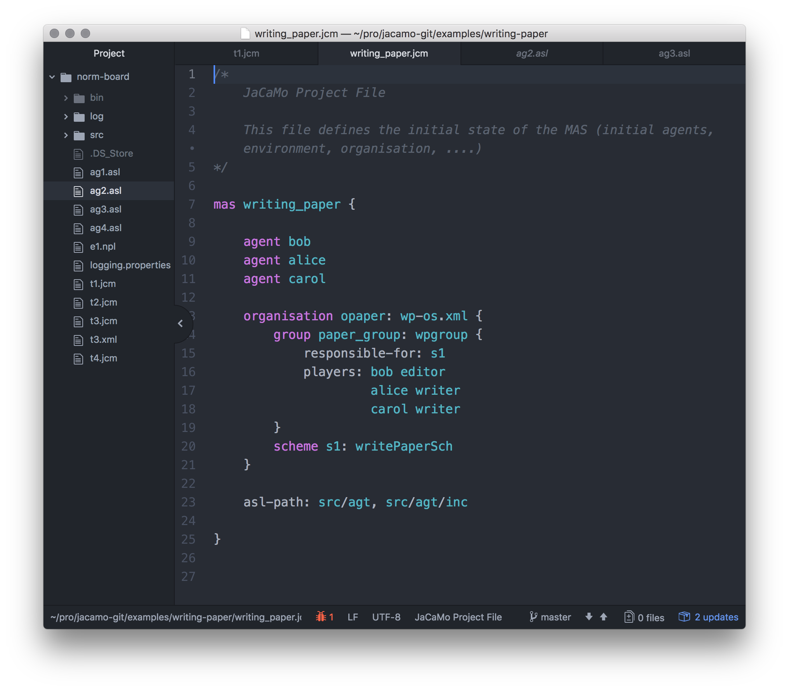
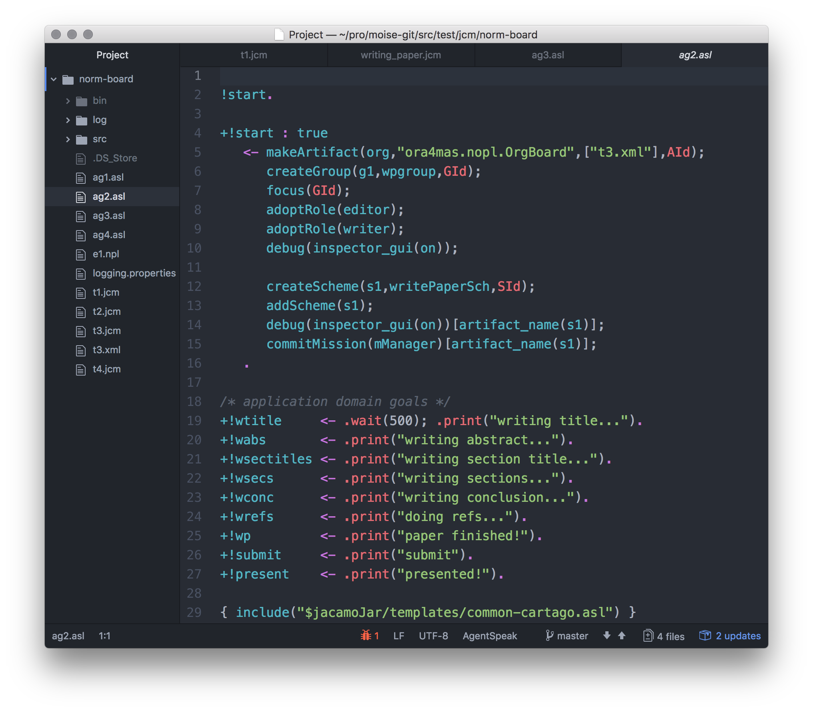

= JaCaMo projects in the shell command
for unix users
:toc: right

== Installation

. Download JaCaMo from https://sourceforge.net/projects/jacamo/files/version-0[here] and unzip it.

. Make sure you have `JACAMO_HOME` properly set (this variable points to a directory with  subdirectories `libs` and `scripts` of JaCaMo), then setup the `PATH`:

    export PATH=$JACAMO_HOME/scripts:$PATH

. Ensure you have `JDK_HOME` properly set (this variable points to a Java Development Kit (JDK) directory)

== Development

. Create a new project with
+
----
jacamo-new-project ../somewhere/helloworld
----
Examples of agent, artifact and organization are placed in the `src` folder.

. And run it with
+
    jacamo ../somewhere/helloworld/helloworld.jcm

If you have https://gradle.org[Gradle] installed, you can also run the application with

    cd ../somewhere/helloworld
    gradle -q

and create an eclipse project with

    gradle eclipse

If you use the https://atom.io[Atom] editor, the following packages provide syntax highlight for AgentSpeak (the Jason language) and JCM projects: https://atom.io/packages/language-jcm[language-jcm] and https://atom.io/packages/language-agentspeak[language-agentspeak].

== Other scripts

=== jacamo-jar

Creates a single jar file with all resources to run the application
----
jacamo-jar some.jcm
----
the application can then be run by
----
java -jar some.jar
----
